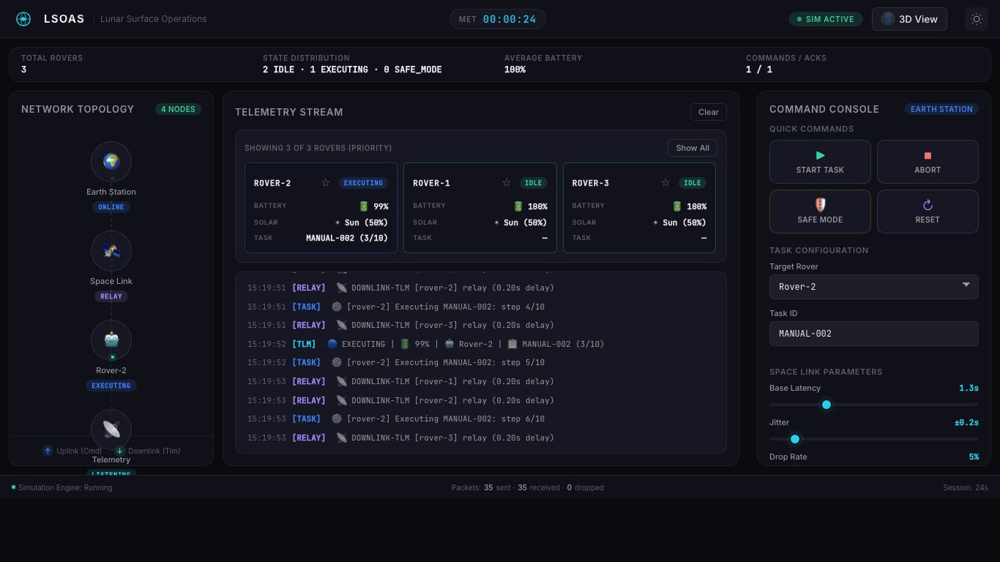
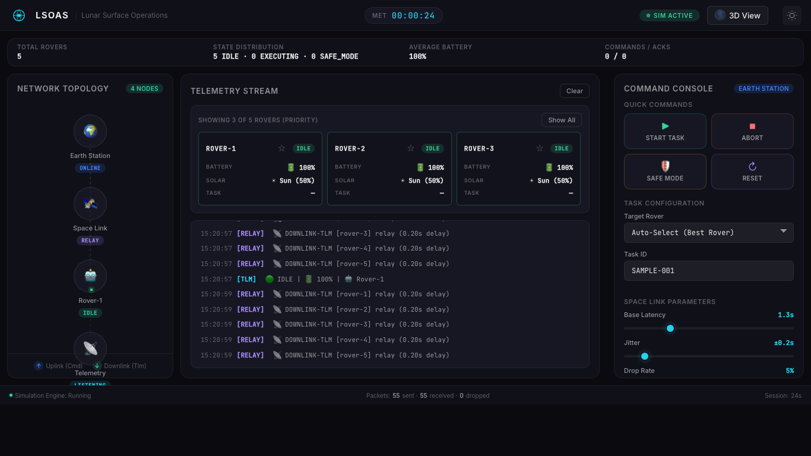

<p align="center">
  
  
  
  
  
</p>

<h1 align="center">LSOAS</h1>
<h3 align="center">Lunar Surface Operations Autonomous Science Network</h3>

<p align="center">
  <strong>Chandrayaan-focused multi-rover mission control and simulation stack.</strong><br/>
  <em>Context-aware task assignment, dynamic fault modeling, and lunar operations telemetry.</em>
</p>

---

## Project Focus (Chandrayaan v2)

The project is now redesigned around a Chandrayaan-themed future mission concept:

- Real mission basis from Chandrayaan-3 rover operations, Chandrayaan-4 sample chain direction, and LUPEX polar prospecting goals.
- Future extension to an Indian lunar-base predeploy and construction swarm.
- Task-centric rover operations instead of generic flat tasks.
- Teaching-oriented dashboard presets for Chandrayaan-3, Chandrayaan-4, LUPEX, and future base-build scenarios.

### Reality Basis

Real mission references:

- [ISRO Chandrayaan-3 details](https://www.isro.gov.in/Chandrayaan3_Details.html)
- [ISRO Chandrayaan-3 updates (Pragyan payload operations)](https://www.isro.gov.in/Ch3_Details.html)
- [ISRO Chandrayaan-4 approval and mission objectives](https://www.isro.gov.in/UnionCabinetapprovesChandrayaan4mission.html)
- [JAXA LUPEX mission overview](https://global.jaxa.jp/projects/sas/lupex/)

Future extrapolation in this repo:

- Multi-purpose rover swarm for base predeploy and base-build logistics.
- Pushing/regolith handling and sample transfer workflows at larger operational scale.

---

## Task Taxonomy and Difficulty Model

### Task Families

1. `movement` - traverse/navigation
2. `science` - in-situ investigation and instrument runs
3. `digging` - excavation/drilling
4. `pushing` - regolith handling/transport
5. `photo` - imaging/survey
6. `sample-handling` - transfer/handling pipeline

### Difficulty Levels

| Level | Base Fault Rate |
| --- | --- |
| `L1` | `1%` |
| `L2` | `3%` |
| `L3` | `6%` |
| `L4` | `10%` |
| `L5` | `18%` |

Final predicted fault probability is context-aware and clamped to `0%..60%` using:

- battery SOC
- lunar day/night state
- solar intensity
- terrain difficulty
- comm quality
- thermal stress
- capability match

Task catalog source (machine-readable):

- `/Users/varma/Desktop/workspace/Lunar-Surface-Operations-Autonomous-Science-Network/web-sim/assets/chandrayaan_task_catalog.json`
- `/Users/varma/Desktop/workspace/Lunar-Surface-Operations-Autonomous-Science-Network/lunar_ops/rover_ws/src/rover_core/rover_core/chandrayaan_task_catalog.json`

---

## Architecture Snapshot

Core runtime nodes/layers:

- `EarthNode` (`earth_node.py`): context-aware assignment engine with score breakdown and deterministic rejection.
- `RoverNode` (`rover_node.py`): variable-duration task execution and dynamic risk/fault behavior.
- `SpaceLinkNode` (`space_link_node.py`): latency/jitter/drop relay model.
- `web-sim/simulation.js`: browser-side parity model with same task taxonomy and risk strategy.

Task-model utility module:

- `/Users/varma/Desktop/workspace/Lunar-Surface-Operations-Autonomous-Science-Network/lunar_ops/rover_ws/src/rover_core/rover_core/task_model.py`

Supporting docs:

- `/Users/varma/Desktop/workspace/Lunar-Surface-Operations-Autonomous-Science-Network/docs/chandrayaan_v2_architecture.md`
- `/Users/varma/Desktop/workspace/Lunar-Surface-Operations-Autonomous-Science-Network/docs/chandrayaan_v2_migration.md`

---

## Dashboard Screenshots

### Main Mission Dashboard States

Idle operations


Executing task flow


Safe mode command flow


### Mission Setup and Selection Flows

Battery-informed rover selection


Manual rover selection



Telemetry-first mission stream



### Visual Theme Variant

Light theme reference


---

## Quick Start

### Web Simulation

```bash
git clone https://github.com/SumanthVarma798/Lunar-Surface-Operations-Autonomous-Science-Network.git
cd Lunar-Surface-Operations-Autonomous-Science-Network/web-sim
python3 -m http.server 8080
```

Open: `http://localhost:8080`

Useful query params:

- `?rovers=5`
- `?scenario=basic-auto&task=CY3-SCI-001&task_type=science&difficulty=L3`
- `?scenario=safe-mode&task=CY4-SAMPLE-008&task_type=sample-handling&difficulty=L4`
- `?mission=cy3-pragyan`
- `?mission=cy4-sample-return&target_site=Sample%20Depot%20Alpha`

Dashboard task IDs are auto-generated (mission + task type + difficulty + sequence), and can still be manually edited at any time.

### ROS 2 Simulation

```bash
cd /Users/varma/Desktop/workspace/Lunar-Surface-Operations-Autonomous-Science-Network
make build
make test-space-link
make test-telemetry
make test-rover
make test-earth
```

---

## Command Payload (START_TASK)

`START_TASK` now supports structured mission fields:

- `task_id`
- `task_type`
- `difficulty_level`
- `required_capabilities`
- `mission_phase`
- `target_site` (optional)
- `assignment_score_breakdown`
- `predicted_fault_probability`

Legacy `START_TASK` with only `task_id` still works and defaults to:

- `task_type=movement`
- `difficulty_level=L2`

---

## Telemetry Additions

Telemetry and fleet status now include:

- `active_task_type`
- `active_task_difficulty`
- `task_total_steps`
- `predicted_fault_probability`
- `assignment_score_breakdown`
- `lunar_time_state`
- `solar_intensity`
- `terrain_difficulty`
- `comm_quality`
- `thermal_stress`

---

## Development Workflow (dev + staging + main)

Use this branch flow for all feature work:

```bash
git fetch origin
git checkout main
git pull --ff-only origin main
git checkout staging || git checkout -b staging origin/main
git pull --ff-only origin staging
git checkout dev || git checkout -b dev origin/staging
git pull --ff-only origin dev

# feature branch from dev
git checkout -b codex/your-feature-name dev
# ... commits ...
git push -u origin codex/your-feature-name
# open PR -> dev
# release gate 1: dev -> staging
# release gate 2: staging -> main
```

Environment mapping:

- `dev` -> playground/integration environment
- `staging` -> production replica and release gate
- `main` -> production

CI triggers on `dev`, `staging`, and `main`.

---

## Chandrayaan v2 Roadmap Issues

Active redesigned roadmap:

- [#38 Epic: Chandrayaan v2 context-aware orchestration](https://github.com/SumanthVarma798/Lunar-Surface-Operations-Autonomous-Science-Network/issues/38)
- [#39 TaskCatalog schema and loader](https://github.com/SumanthVarma798/Lunar-Surface-Operations-Autonomous-Science-Network/issues/39)
- [#40 Dynamic fault-rate engine](https://github.com/SumanthVarma798/Lunar-Surface-Operations-Autonomous-Science-Network/issues/40)
- [#41 Capability-class assignment output](https://github.com/SumanthVarma798/Lunar-Surface-Operations-Autonomous-Science-Network/issues/41)
- [#42 Variable-duration execution engine](https://github.com/SumanthVarma798/Lunar-Surface-Operations-Autonomous-Science-Network/issues/42)
- [#43 Web task controls](https://github.com/SumanthVarma798/Lunar-Surface-Operations-Autonomous-Science-Network/issues/43)
- [#44 Expanded telemetry schema](https://github.com/SumanthVarma798/Lunar-Surface-Operations-Autonomous-Science-Network/issues/44)
- [#45 Validation suite](https://github.com/SumanthVarma798/Lunar-Surface-Operations-Autonomous-Science-Network/issues/45)
- [#46 Docs and migration](https://github.com/SumanthVarma798/Lunar-Surface-Operations-Autonomous-Science-Network/issues/46)

---

## Testing

Run core unit/integration tests:

```bash
pytest -q /Users/varma/Desktop/workspace/Lunar-Surface-Operations-Autonomous-Science-Network/lunar_ops/rover_ws/src/rover_core/test
```

Expected coverage targets for v2 scope:

- Task catalog validation
- L1..L5 behavior differences
- Context modifier influence on risk
- Capability-aware assignment selection
- Deterministic rejection when infeasible
- Legacy command fallback behavior

Detailed testing guide:

- `/Users/varma/Desktop/workspace/Lunar-Surface-Operations-Autonomous-Science-Network/docs/chandrayaan_v2_testing.md`

---

## License

MIT
