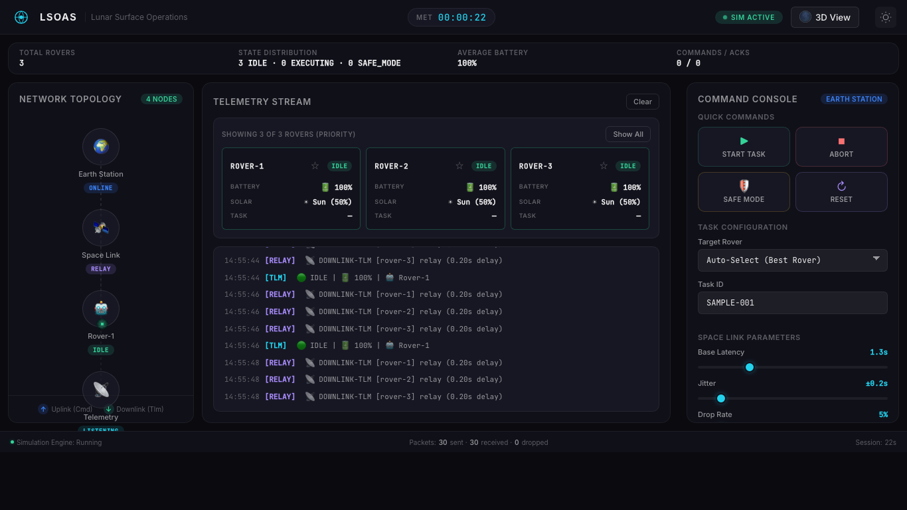
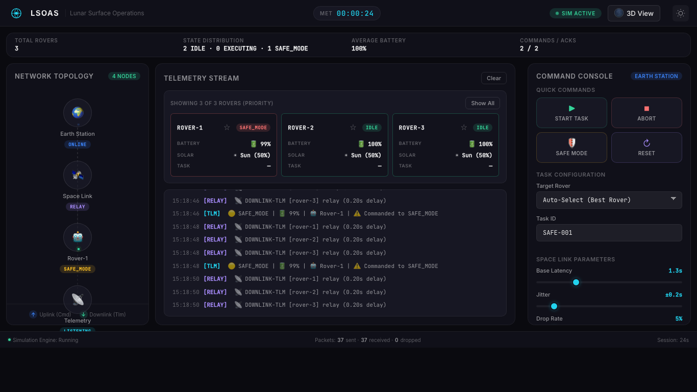
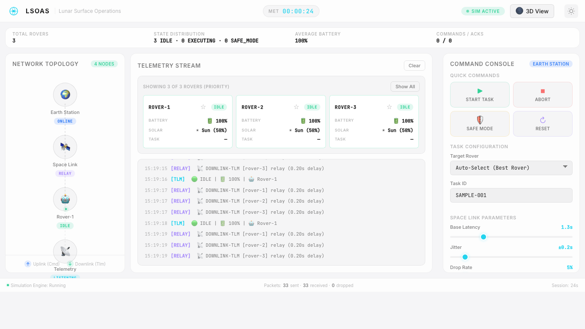

<p align="center">
  
  
  
  
  
  <br/>
  <a href="https://github.com/SumanthVarma798/Lunar-Surface-Operations-Autonomous-Science-Network/actions">
    
  </a>
  <a href="https://github.com/users/SumanthVarma798/projects/6">
    
  </a>
</p>

<h1 align="center">🌙 LSOAS</h1>
<h3 align="center">Lunar Surface Operations Autonomous Science Network</h3>

<p align="center">
  <strong>From a single rover to a fully autonomous lunar fleet.</strong><br/>
  <em>Mission control. Multi-rover orchestration. 3D lunar visualization.<br/>
  AI-driven science campaigns — all in your browser.</em>
</p>

---

> **🚀 This project is under active development.** What started as a single-rover command prototype is evolving into a full-scale, multi-asset space mission control system. Follow the [roadmap](#-roadmap--whats-coming) to see where we're headed.

---

## 🖥️ Live Dashboard — What We've Built So Far

A NASA-inspired fleet dashboard simulating Earth↔Moon communication with realistic latency, packet loss, and fault-tolerant command protocols across multiple rovers. No Docker or ROS required — just open it in your browser.

### Dashboard States

<table>
<tr>
<td><strong>Idle — Awaiting Commands</strong></td>
<td><strong>Executing — Task In Progress</strong></td>
</tr>
<tr>
<td></td>
<td></td>
</tr>
<tr>
<td><strong>Safe Mode — Fault Detected</strong></td>
<td><strong>Light Theme</strong></td>
</tr>
<tr>
<td></td>
<td></td>
</tr>
</table>

---

## 🗺️ Roadmap — What's Coming

This isn't just a dashboard. We're building a **full mission operations system** — incrementally, phase by phase. Each phase adds a new layer of realism, complexity, and genuine aerospace engineering.

<table>
<tr>
<th>Phase</th>
<th>Focus</th>
<th>Key Deliverables</th>
<th>Status</th>
</tr>
<tr>
<td>🟢 <strong>Phase 1</strong></td>
<td><strong>Multi-Rover Constellation</strong></td>
<td>3-5 simultaneous rovers • Fleet manager • Auto task assignment • 3D lunar surface with real NASA textures • Fleet status grid</td>
<td>🚧 In Progress</td>
</tr>
<tr>
<td>⚪ <strong>Phase 2</strong></td>
<td><strong>Resource Management</strong></td>
<td>Solar power simulation • Thermal management • Comm bandwidth budgets • Consumable tracking</td>
<td>Planned</td>
</tr>
<tr>
<td>⚪ <strong>Phase 3</strong></td>
<td><strong>Ground Station Network</strong></td>
<td>DSN-inspired multi-station coverage • Earth-rotation scheduling • Handoff logic • 3D globe visualization</td>
<td>Planned</td>
</tr>
<tr>
<td>⚪ <strong>Phase 4</strong></td>
<td><strong>Autonomous Mission Planning</strong></td>
<td>24-hour command sequences • Conditional logic • Gantt timeline editor • Autonomous replanning</td>
<td>Planned</td>
</tr>
<tr>
<td>⚪ <strong>Phase 5</strong></td>
<td><strong>Advanced Fleet Coordination & AI</strong></td>
<td>Swarm navigation • Collision avoidance • Inter-rover mesh network • RL path planning • Anomaly detection</td>
<td>Planned</td>
</tr>
</table>

> 📋 **Full task breakdown**: See the [LSOAS Mission Roadmap](https://github.com/users/SumanthVarma798/projects/6) on GitHub Projects — 20+ issues across 5 milestones.

---

## 🌍 Phase 1 Highlights — What's Being Built Now

### 🤖 Multi-Rover Fleet Operations

Transform the single-rover system into a **fleet of 3-5 autonomous rovers**, each with unique IDs, independent state machines, and telemetry streams. A centralized **Fleet Manager** node will orchestrate task assignment based on battery levels, solar exposure, and operational state.

```
┌───────────┐     ┌─────────────┐     ┌──────────┐  ┌──────────┐  ┌──────────┐
│   EARTH   │────▶│ SPACE LINK  │────▶│ ROVER-1  │  │ ROVER-2  │  │ ROVER-3  │
│  STATION  │◀────│   (RELAY)   │◀────│  (IDLE)  │  │(EXECUTING│  │  (SAFE)  │
└───────────┘     └─────────────┘     └──────────┘  └──────────┘  └──────────┘
      │                                     ▲              ▲             ▲
      │           ┌─────────────┐           │              │             │
      └──────────▶│   FLEET     │───────────┴──────────────┴─────────────┘
                  │  MANAGER    │   Tracks all rover states, auto-assigns tasks
                  └─────────────┘
```

### 🌙 3D Lunar Surface Visualization

An interactive **Three.js-powered 3D Moon** using real NASA surface textures from the Lunar Reconnaissance Orbiter. Rovers appear as markers on the surface, relay satellites orbit with visible communication beams, and you can rotate, zoom, and click to control the mission.

| Data Source                                                                          | Usage                             |
| ------------------------------------------------------------------------------------ | --------------------------------- |
| [NASA CGI Moon Kit](https://svs.gsfc.nasa.gov/4720)                                  | High-res color map + displacement |
| [LRO WAC Global Mosaic](https://wms.lroc.asu.edu/lroc/global_product/100_mpp_warped) | 100m/px surface texture           |
| [LOLA Elevation Data](https://pgda.gsfc.nasa.gov/products/54)                        | Terrain displacement mapping      |

### 📊 Fleet Dashboard

A responsive status grid replacing the single-rover view:

```
┌─────────────────────────────────────────────────────┐
│  🤖 Fleet: 3 active │ Avg Battery: 68% │ 2 IDLE    │
├─────────┬─────────┬─────────────────────────────────┤
│ ROVER-1 │ ROVER-2 │ ROVER-3                         │
│  IDLE   │EXECUTING│  SAFE_MODE                      │
│ 🔋 87%  │ 🔋 45%  │ 🔋 23%                          │
│ ☀️ Sun  │ 🌑 Dark │ ☀️ Sun                          │
└─────────┴─────────┴─────────────────────────────────┘
```

---

## 🏗️ Current Architecture

```
┌────────────────────────────────────────────────────────────────────────────┐
│                            MISSION CONTROL                                 │
│                                                                            │
│  ┌──────────────┐     ┌──────────────┐     ┌───────────────────────────┐   │
│  │ EARTH STATION│────▶│  SPACE LINK  │────▶│  ROVER FLEET (N = 3..5+)  │   │
│  │ (COMMAND UI) │◀────│   (RELAY)    │◀────│  R1  R2  R3  R4  R5 ...   │   │
│  └──────────────┘     └──────────────┘     └───────────────────────────┘   │
│         │                        │                         │                │
│         │                        │                         │                │
│         │                ACK + TELEMETRY STREAMS           │                │
│         │                        ▼                         │                │
│         │              ┌────────────────────┐              │                │
│         └─────────────▶│ TELEMETRY MONITOR  │◀─────────────┘                │
│                        │ + FLEET STATUS GRID│                               │
│                        └────────────────────┘                               │
└────────────────────────────────────────────────────────────────────────────┘
```

| Node / Layer             | Role                         | Key Behaviors                                                                 |
| ------------------------ | ---------------------------- | ----------------------------------------------------------------------------- |
| **🌍 Earth Station**     | Ground command interface     | Fleet-aware dispatch, ACK tracking, auto/manual target selection             |
| **📡 Space Link**        | Moon↔Earth relay             | Configurable latency/jitter/drop simulation                                  |
| **🤖 Rover Fleet**       | Autonomous rover constellation | Per-rover state machine (IDLE→EXECUTING→SAFE_MODE→ERROR), battery/task state |
| **📊 Telemetry Monitor** | Fleet telemetry visualization | Per-rover feed aggregation, fleet summary banner, command/ACK counters       |

### Rover State Machine

```
            START_TASK
  ┌──────┐ ──────────▶ ┌───────────┐
  │ IDLE │              │ EXECUTING │
  └──┬───┘ ◀────────── └─────┬─────┘
     │       task done       │
     │                  fault detected
     │ RESET                 │
     │       ┌───────────┐   │
     └────── │ SAFE_MODE │ ◀─┘
             └─────┬─────┘
                   │ unrecoverable
             ┌─────▼─────┐
             │   ERROR   │
             └───────────┘
```

---

## 🚀 Quick Start

### Option 1: Web Simulation (Recommended)

No dependencies — just a browser and Python.

```bash
# Clone
git clone https://github.com/SumanthVarma798/Lunar-Surface-Operations-Autonomous-Science-Network.git
cd Lunar-Surface-Operations-Autonomous-Science-Network

# Launch
cd web-sim && python3 -m http.server 8080
```

Open **http://localhost:8080** and start sending commands! 🎉

Fleet presets:

- Default 3-rover run: `http://localhost:8080`
- 5-rover load profile: `http://localhost:8080/?rovers=5`
- Light theme preview: `http://localhost:8080/?theme=light`

#### Keyboard Shortcuts

| Key         | Command    |
| ----------- | ---------- |
| `S`         | Start Task |
| `A`         | Abort      |
| `Shift + S` | Safe Mode  |
| `R`         | Reset      |

#### Configurable Parameters

| Parameter         | Default | Range      | Description                |
| ----------------- | ------- | ---------- | -------------------------- |
| Base Latency      | 1.3s    | 0.1 – 5.0s | One-way signal travel time |
| Jitter            | ±0.2s   | 0 – 1.0s   | Random delay variation     |
| Drop Rate         | 5%      | 0 – 50%    | Packet loss probability    |
| Fault Probability | 10%     | 0 – 100%   | Fault chance per task step |

#### Fleet Command Routing

Use **Target Rover** in the command panel:

- `Auto-Select (Best Rover)`: routes based on live fleet conditions.
- `Rover-n`: manual override to target a specific rover.

Routing behavior in auto mode:

- `START_TASK`: prefers highest-score `IDLE` rover.
- `ABORT`: prefers currently executing rover with highest progress.
- `GO_SAFE`: prefers active executing rover; falls back to highest-score rover.
- `RESET`: prefers lowest-battery rover currently in `SAFE_MODE`.

Reference manual test report: `docs/phase1_testing_results.md`

### Option 2: ROS 2 Simulation (Full Setup)

Requires Docker and ROS 2 Humble.

```bash
make build                # Build ROS workspace in Docker

# Launch in separate terminals:
make test-space-link      # Terminal 1: Space Link relay
make test-telemetry       # Terminal 2: Telemetry monitor
make test-rover           # Terminal 3: Rover node
make test-earth           # Terminal 4: Earth station (interactive)
```

---

## 📁 Project Structure

```
Lunar-Surface-Operations-Autonomous-Science-Network/
│
├── web-sim/                          # 🌐 Browser-based simulation
│   ├── index.html                    #    Dashboard layout
│   ├── index.css                     #    Design system (dark/light themes)
│   ├── simulation.js                 #    Simulation engine (4 nodes in JS)
│   └── app.js                        #    UI controller & DOM bindings
│
├── lunar_ops/                        # 🤖 ROS 2 implementation
│   ├── docs/                         #    Concept & test documentation
│   └── rover_ws/src/rover_core/      #    ROS package
│       └── rover_core/
│           ├── rover_node.py         #    Rover state machine
│           ├── earth_node.py         #    Earth command interface
│           ├── space_link_node.py    #    Communication relay
│           └── telemetry_monitor.py  #    Telemetry display
│
├── .agent/workflows/                 # 🤖 Agent workflows
│   ├── implement-issue.md            #    /implement-issue — build a feature
│   ├── explain-issue.md              #    /explain-issue — break down a task
│   └── compare-issues.md             #    /compare-issues — side-by-side analysis
│
├── .github/
│   ├── workflows/ci.yml             #    CI pipeline (lint, build, tests, health)
│   └── scripts/                      #    Project automation scripts
│
├── scripts/rosdev.sh                 #    Docker dev environment helper
├── Makefile                          #    Build & run automation
└── .gitignore
```

---

## 🔧 Development Workflow

### Branch-Based Development

```bash
git checkout main && git pull origin main     # Start from latest
git checkout -b feature/your-feature-name     # Create feature branch
# ... make changes ...
git commit -m "feat: description"             # Conventional commits
git push -u origin feature/your-feature-name  # Push & open PR
```

### CI Pipeline

Every PR to `main` automatically runs:

| Check               | What it validates                                          |
| ------------------- | ---------------------------------------------------------- |
| 🐍 **Python Lint**  | Flake8 on all ROS nodes                                    |
| 🤖 **ROS 2 Build**  | Full `colcon build` in `ros:humble` container              |
| 🧪 **Python Tests** | Auto-discovers and runs `test_*.py` with pytest            |
| 🌐 **Web Health**   | HTML structure, JS syntax, CSS validation, HTTP smoke test |
| 📋 **Repo Health**  | Required files, large file detection, secret scanning      |

### Commit Convention

| Prefix      | Usage              |
| ----------- | ------------------ |
| `feat:`     | New feature        |
| `fix:`      | Bug fix            |
| `chore:`    | Maintenance        |
| `docs:`     | Documentation      |
| `refactor:` | Code restructuring |
| `ci:`       | CI/CD changes      |

---

## 🧪 Testing Scenarios

| Scenario                  | Steps                                                          | What to Observe                                            |
| ------------------------- | -------------------------------------------------------------- | ---------------------------------------------------------- |
| **Basic auto assignment** | Auto target → START TASK                                       | Exactly one rover enters `EXECUTING`, ACK resolves         |
| **Manual selection**      | Select `Rover-2` → START TASK                                  | Command routes only to selected rover                      |
| **Safe mode handling**    | START TASK → GO SAFE                                           | Rover transitions to `SAFE_MODE` and fleet counts update   |
| **Battery priority**      | Set uneven batteries → Auto START TASK                         | Highest-battery eligible rover receives task               |
| **5-rover load**          | Open `?rovers=5` and observe ~20s                              | Stable telemetry feed from rover-1..rover-5 at 0.5 Hz each |
| **Network stress**        | Increase Drop/Latency sliders and dispatch commands            | Retries, delayed ACKs, and drop indicators in logs         |

---

## 🎨 Design Philosophy

- **Dark-first** — Deep space-black with high-contrast elements
- **Frosted glass** — `backdrop-filter: blur()` panels for depth
- **Typography** — SF Pro / Inter with careful hierarchy
- **Color semantics** — Green (nominal), Yellow (warning), Red (error), Blue (executing)
- **Micro-animations** — Smooth transitions on state changes
- **Information density** — All critical data visible at a glance

---

## 🔮 The Full Vision

When complete, LSOAS will simulate a **realistic multi-asset lunar mission** — the kind of system NASA JPL builds for real missions like Mars 2020 and Artemis. The full system will include:

- **Fleet of autonomous rovers** navigating the lunar surface with independent AI
- **3D interactive globe** with real NASA LRO textures and orbital mechanics
- **Deep Space Network simulation** with realistic coverage windows and antenna scheduling
- **Autonomous mission planning** with conditional command sequences and replanning
- **Swarm coordination** with formation flying, collision avoidance, and mesh networking
- **Machine learning** for path planning, anomaly detection, and science prioritization

This is a learning project with professional aspirations — every system mirrors real aerospace engineering patterns.

---

## 📄 License

MIT

---

<p align="center">
  <em>Built for learning. Engineered like the real thing.</em><br/>
  <strong>🌙 LSOAS — Lunar Surface Operations Autonomous Science Network</strong><br/><br/>
  <a href="https://github.com/users/SumanthVarma798/projects/6">📋 Project Board</a> •
  <a href="https://github.com/SumanthVarma798/Lunar-Surface-Operations-Autonomous-Science-Network/milestones">🏁 Milestones</a> •
  <a href="https://github.com/SumanthVarma798/Lunar-Surface-Operations-Autonomous-Science-Network/issues">📝 Issues</a>
</p>
