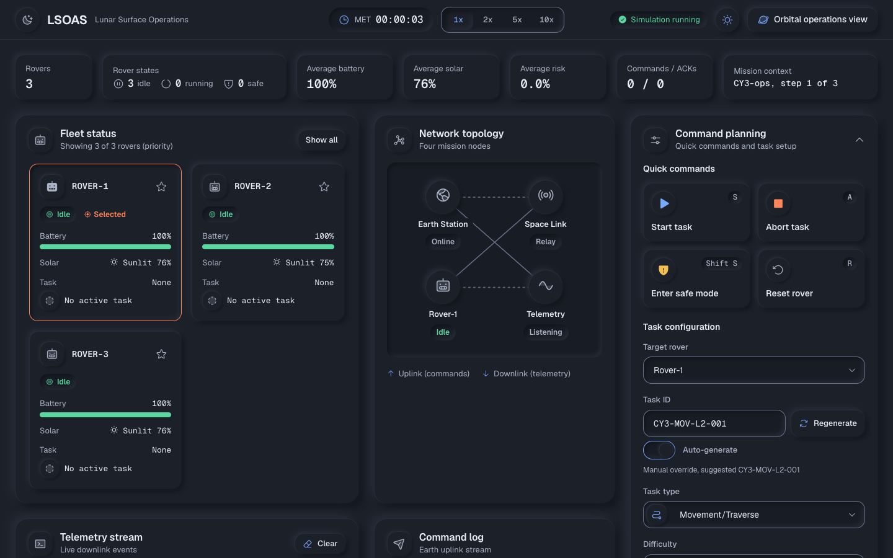
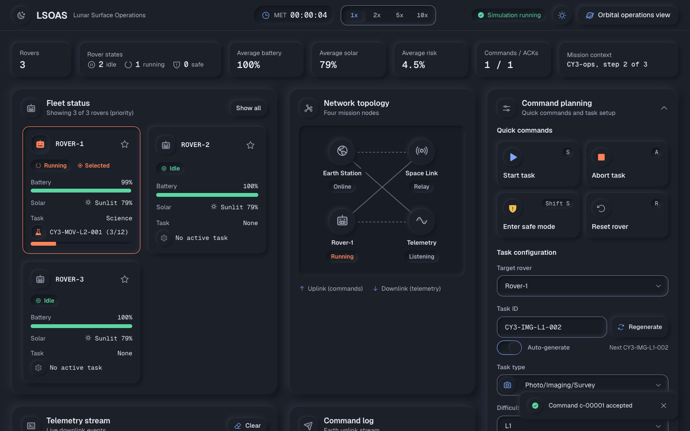
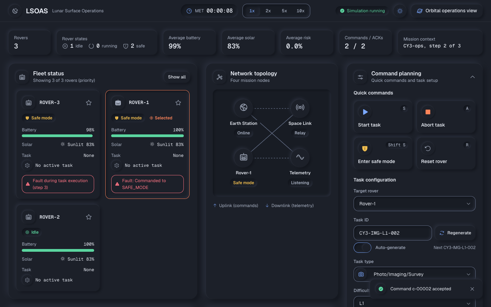
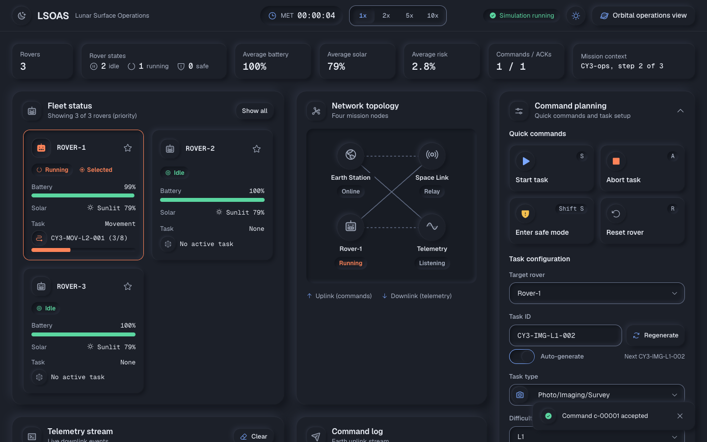
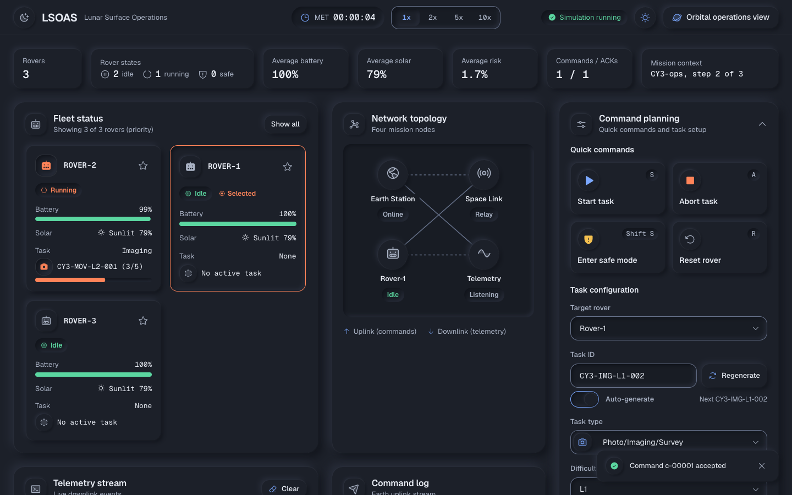
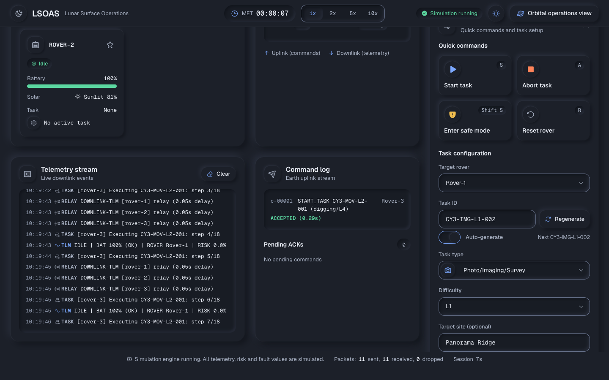
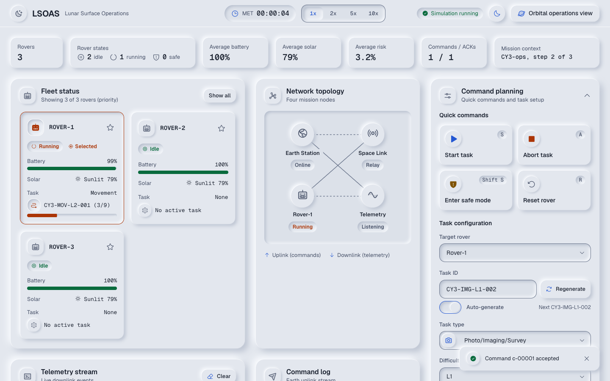
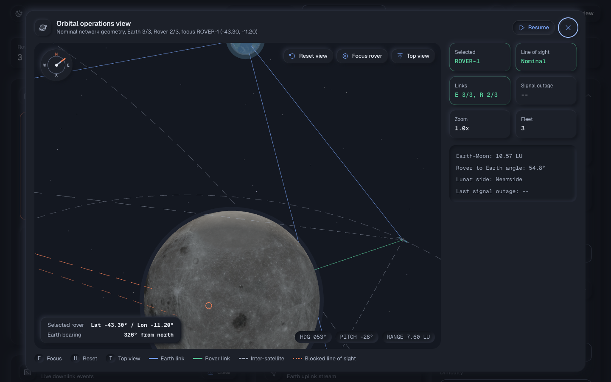

<p align="center">
  
  
  
  
  
</p>

<h1 align="center">LSOAS</h1>
<h3 align="center">Lunar Surface Operations Autonomous Science Network</h3>

<p align="center">
  <strong>Chandrayaan-focused multi-rover mission control and simulation stack.</strong><br/>
  <em>Context-aware task assignment, dynamic fault modeling, and lunar operations telemetry.</em>
</p>

---

## Project Focus (Chandrayaan v2)

The project is now redesigned around a Chandrayaan-themed future mission concept:

- Real mission basis from Chandrayaan-3 rover operations, Chandrayaan-4 sample chain direction, and LUPEX polar prospecting goals.
- Future extension to an Indian lunar-base predeploy and construction swarm.
- Task-centric rover operations instead of generic flat tasks.
- Teaching-oriented dashboard presets for Chandrayaan-3, Chandrayaan-4, LUPEX, and future base-build scenarios.

### Reality Basis

Real mission references (links checked 2026-09-30):

- [ISRO Chandrayaan-3 details](https://www.isro.gov.in/Chandrayaan3_Details.html)
- [ISRO Chandrayaan-3 launch vehicle brochure (PDF)](https://www.isro.gov.in/media_isro/pdf/Missions/LVM3/LVM3M4_Chandrayaan3_brochure.pdf)
- [PIB: Union Cabinet approval for Chandrayaan-4](https://www.pib.gov.in/PressReleasePage.aspx?PRID=2055983)
- [ISRO: Chandrayaan-4 lunar sample return national science meet](https://www.isro.gov.in/ISRO_Nationalsciencemeet_ch4.html)
- [JAXA: Lunar Polar Exploration Mission (LUPEX)](https://www.exploration.jaxa.jp/e/program/lunarpolar/)

What those sources say, and what this repo does with it:

- **Chandrayaan-3.** The 26 kg Pragyan rover carried a LIBS and an APXS spectrometer and was designed for one lunar day (about 14 Earth days). It landed near the south pole at Shiv Shakti Point on 23 August 2023 ([dates: Wikipedia](https://en.wikipedia.org/wiki/Chandrayaan-3)). The CY3 preset is a teaching analog of that surface work.
- **Chandrayaan-4.** Approved by the Union Cabinet in September 2024. The goal is to land, collect a sample with a robotic arm, launch from the surface and return it to Earth, with a south polar landing site near permanently shadowed regions. ISRO's page lists a 2027 timeline; more recent ISRO statements point to 2028 ([reporting](https://www.deccanherald.com/india/isro-to-triple-spacecraft-output-launch-chandrayaan-4-in-2028-chairman-v-narayanan-3799777)). The CY4 preset models the sample chain, not the real mission timeline.
- **LUPEX.** A joint JAXA and ISRO south polar mission (India calls it Chandrayaan-5) with NASA and ESA instruments, planned on a Japanese H3 rocket, no earlier than 2028 according to JAXA. The LUPEX preset models a water-ice survey in that spirit.

Mission dates move often. Treat the linked pages as the source of truth.

Future extrapolation in this repo (not an announced mission):

- Multi-purpose rover swarm for base predeploy and base-build logistics.
- Pushing/regolith handling and sample transfer workflows at larger operational scale.

---

## Task Taxonomy and Difficulty Model

### Task Families

1. `movement` - traverse/navigation
2. `science` - in-situ investigation and instrument runs
3. `digging` - excavation/drilling
4. `pushing` - regolith handling/transport
5. `photo` - imaging/survey
6. `sample-handling` - transfer/handling pipeline

### Difficulty Levels

These are simulation model parameters chosen for teaching, not published mission data.

| Level | Base Fault Rate |
| --- | --- |
| `L1` | `1%` |
| `L2` | `3%` |
| `L3` | `6%` |
| `L4` | `10%` |
| `L5` | `18%` |

Final predicted fault probability is context-aware and clamped to `0%..60%` using:

- battery SOC
- lunar day/night state
- solar intensity
- terrain difficulty
- comm quality
- thermal stress
- capability match

Task catalog source (machine-readable):

- `web-sim/assets/chandrayaan_task_catalog.json`
- `lunar_ops/rover_ws/src/rover_core/rover_core/chandrayaan_task_catalog.json`

---

## Architecture Snapshot

Core runtime nodes/layers:

- `EarthNode` (`earth_node.py`): context-aware assignment engine with score breakdown and deterministic rejection.
- `RoverNode` (`rover_node.py`): variable-duration task execution and dynamic risk/fault behavior.
- `SpaceLinkNode` (`space_link_node.py`): latency/jitter/drop relay model.
- `web-sim/simulation.js`: browser-side parity model with same task taxonomy and risk strategy.

Task-model utility module:

- `lunar_ops/rover_ws/src/rover_core/rover_core/task_model.py`

Supporting docs:

- `docs/chandrayaan_v2_architecture.md`
- `docs/chandrayaan_v2_migration.md`
- `docs/roadmap.md`

---

## Dashboard Screenshots

Captured from the web simulation at 1440 x 900 with the scenario query parameters listed under Quick Start.

### Main Mission Dashboard States

Idle operations



Executing task flow



Safe mode command flow



### Mission Setup and Selection Flows

Auto-selected rover (best battery and capability match)



Manual rover selection



Telemetry stream and command log during a digging task



### Themes and Orbital View

Light theme



Orbital operations view (dialog)



---

## Quick Start

### Web Simulation

```bash
git clone https://github.com/SumanthVarma798/Lunar-Surface-Operations-Autonomous-Science-Network.git
cd Lunar-Surface-Operations-Autonomous-Science-Network/web-sim
python3 -m http.server 8080
```

Open: `http://localhost:8080`

Useful query params:

- `?rovers=5`
- `?scenario=basic-auto&task=CY3-SCI-001&task_type=science&difficulty=L3`
- `?scenario=safe-mode&task=CY4-SAMPLE-008&task_type=sample-handling&difficulty=L4`
- `?mission=cy3-pragyan`
- `?mission=cy4-sample-return&target_site=Sample%20Depot%20Alpha`
- `?open3d=1` opens the orbital view on load

Dashboard task IDs are auto-generated (mission + task type + difficulty + sequence), and can still be manually edited at any time.

### Web Simulation UI

A soft-UI (neumorphic) mission control dashboard. No build step: plain HTML, CSS and JavaScript.

| File | Role |
| --- | --- |
| `web-sim/index.html` | Markup |
| `web-sim/tokens.css` | Design tokens: colors, one radius scale, shadows, motion, fonts. Dark, light, high-contrast and forced-colors variants |
| `web-sim/styles.css` | Layout and components |
| `web-sim/theme.js` | Applies the saved theme before first paint |
| `web-sim/ui.js` | Theme toggle, segmented controls, dialog focus trap, toasts, number count-ups, icon maps |
| `web-sim/app.js` | Controller that connects the UI to the simulation |
| `web-sim/simulation.js` | Browser-side simulation engine |
| `web-sim/lunar3d.js` | Orbital scene. Three.js and the textures load the first time the orbital view opens |

Design notes:

- Dark theme by default, light theme from the system setting or the header toggle (saved in `localStorage`). Text and icons meet WCAG AA contrast on every surface (4.5:1 text, 3:1 icons and control borders). Shadows never carry state on their own: state is also shown with text, icons or an accent color.
- Two accents: blue for interactive and selected, orange for the active rover or task. Green, amber and red are status colors only.
- Fonts: Geist and Geist Mono, self-hosted in `web-sim/assets/fonts`. Icons: Phosphor, loaded from the jsDelivr CDN. Without the CDN the icons are missing but every control still has a text label.
- Motion uses only `transform` and `opacity`, one easing curve, and is removed under `prefers-reduced-motion`. The only looping animation is the spinner on a running rover.
- Keyboard: `S` start task, `A` abort, `Shift+S` safe mode, `R` reset rover. In the orbital view: `F` focus rover, `H` reset view, `T` top view, `Esc` closes.
- Asset credits are in `web-sim/assets/CREDITS.txt`.

Run the Playwright tests (they expect the server on port 8085):

```bash
cd web-sim
npm ci
python3 -m http.server 8085 &
npx playwright test --project=chromium
```

The `webkit` project also needs `npx playwright install webkit`.

### ROS 2 Simulation

```bash
cd Lunar-Surface-Operations-Autonomous-Science-Network
make build
make test-space-link
make test-telemetry
make test-rover
make test-earth
```

---

## Command Payload (START_TASK)

`START_TASK` now supports structured mission fields:

- `task_id`
- `task_type`
- `difficulty_level`
- `required_capabilities`
- `mission_phase`
- `target_site` (optional)
- `assignment_score_breakdown`
- `predicted_fault_probability`

Legacy `START_TASK` with only `task_id` still works and defaults to:

- `task_type=movement`
- `difficulty_level=L2`

---

## Telemetry Additions

Telemetry and fleet status now include:

- `active_task_type`
- `active_task_difficulty`
- `task_total_steps`
- `predicted_fault_probability`
- `assignment_score_breakdown`
- `lunar_time_state`
- `solar_intensity`
- `terrain_difficulty`
- `comm_quality`
- `thermal_stress`

---

## Development Workflow (dev + staging + main)

Use this branch flow for all feature work:

```bash
git fetch origin
git checkout main
git pull --ff-only origin main
git checkout staging || git checkout -b staging origin/main
git push -u origin staging || true
git pull --ff-only origin staging
git checkout dev || git checkout -b dev origin/staging || git checkout -b dev staging
git push -u origin dev || true
git pull --ff-only origin dev

# feature branch from dev
git checkout -b codex/your-feature-name dev
# ... commits ...
git push -u origin codex/your-feature-name
# open PR -> dev
# release gate 1: dev -> staging
# release gate 2: staging -> main
```

Environment mapping:

- `dev` -> playground/integration environment
- `staging` -> production replica and release gate
- `main` -> production

`develop` is now legacy for this repository and should not receive new feature PRs.

CI triggers on `dev`, `staging`, and `main`.

GitHub Environments are used for gated promotion:

- `dev` environment for playground/integration deploys
- `staging` environment as production replica for validation/sign-off
- `production` environment for final releases from `main`

Deployment workflow file:

- `.github/workflows/deploy-environments.yml`

---

## Hosted Deployment (Auto on Release)

Web simulation hosting is automated by:

- `.github/workflows/release-web-sim.yml`

Behavior:

- On every GitHub Release (`published`), the workflow deploys `web-sim/` to GitHub Pages.
- You can also run it manually via `workflow_dispatch`.

One-time setup:

1. In repository settings, set GitHub Pages source to **GitHub Actions**.

Result:

- Creating a release refreshes the hosted simulation automatically.
- GitHub Pages URL: [https://sumanthvarma798.github.io/Lunar-Surface-Operations-Autonomous-Science-Network/](https://sumanthvarma798.github.io/Lunar-Surface-Operations-Autonomous-Science-Network/)

---

## Agent Workflows

This repository includes a committed agent playbook so local clones and forks behave consistently.

- `AGENTS.md` is the repository-level entrypoint for coding agents.
- `.agent/workflows/` contains the canonical branch/PR, implementation, and release runbooks.
- `.agent/artifacts/` is local scratch space for generated plans/walkthrough notes and is intentionally not committed.

---

## Roadmap Status

### Phase 1 (Complete)

- Baseline release: [`v1.0.0`](https://github.com/SumanthVarma798/Lunar-Surface-Operations-Autonomous-Science-Network/releases/tag/v1.0.0)
- Release PR: [#52](https://github.com/SumanthVarma798/Lunar-Surface-Operations-Autonomous-Science-Network/pull/52)
- Completed issue set: [#38](https://github.com/SumanthVarma798/Lunar-Surface-Operations-Autonomous-Science-Network/issues/38) through [#46](https://github.com/SumanthVarma798/Lunar-Surface-Operations-Autonomous-Science-Network/issues/46)

### Phase 2 (Active)

Milestone: `Phase 2: Chandrayaan Teaching & Base Operations`

- [#53 Epic: Phase 2 teaching missions and lunar-base operations](https://github.com/SumanthVarma798/Lunar-Surface-Operations-Autonomous-Science-Network/issues/53)
- [#54 Mission preset packs v2](https://github.com/SumanthVarma798/Lunar-Surface-Operations-Autonomous-Science-Network/issues/54)
- [#55 Base-build operations pack](https://github.com/SumanthVarma798/Lunar-Surface-Operations-Autonomous-Science-Network/issues/55)
- [#56 Multi-sol energy and thermal planner](https://github.com/SumanthVarma798/Lunar-Surface-Operations-Autonomous-Science-Network/issues/56)
- [#57 Mission replay and explainability timeline](https://github.com/SumanthVarma798/Lunar-Surface-Operations-Autonomous-Science-Network/issues/57)
- [#58 Phase 2 validation matrix and release criteria](https://github.com/SumanthVarma798/Lunar-Surface-Operations-Autonomous-Science-Network/issues/58)

---

## Testing

Run core unit/integration tests:

```bash
pytest -q lunar_ops/rover_ws/src/rover_core/test
```

Expected coverage targets for v2 scope:

- Task catalog validation
- L1..L5 behavior differences
- Context modifier influence on risk
- Capability-aware assignment selection
- Deterministic rejection when infeasible
- Legacy command fallback behavior

Detailed testing guide:

- `docs/chandrayaan_v2_testing.md`

---

## License

MIT
